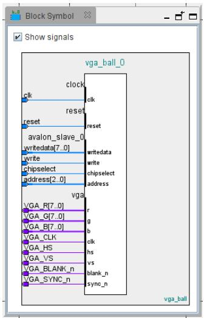

# csee 4840

# Embedded System Design

# Lab 3: Peripherals and Device Drivers

Stephen A. Edwards

Columbia University

Spring 2026

Implement on the fpga a memory-mapped peripheral (an Avalon mm agent) that receives communication from the arm processors on the Cyclone V. Communicate with your peripheral through a Linux userspace program that accesses a device driver you have written.

Display a ball on the vga screen with your peripheral. Implement an ioctl in your device drive that sends your peripheral coordinates from software.

# 1 Introduction

In this lab, you will extend the provided hardware and software so a Linux userspace program controls a custom fpga peripheral through a device driver. The end result is a bouncing ball on the vga display: the peripheral generates video for the ball, the userspace program updates its position, and the device driver passes those updates to hardware.

# 2 Compile the vga Component Into a New fpga Image

Use Platform Designer (`qsys-edit soc_system.qsys`) to add a new `vga_ball` component from `vga_ball.sv`, set its top-level module to `vga_ball`, and fix the inferred interfaces. In particular, set `avalon_slave_0`'s associated reset to `reset`, create a `Conduit` interface named `vga`, move all `vga_` signals into it, and rename each signal type to the lowercase suffix after `vga_` such as `blank_n`. Clear all warnings and errors before finishing.

After Platform Designer writes `vga_ball_hw.tcl`, add these lines after the `module vga_ball` section so the device appears correctly in the device tree:

```tcl
set_module_assignment embeddedsw.dtsvendor "csee4840"
setmodule_assignment embeddedsw.dts.name "vga_ball"
setmodule_assignment embeddedsw.dts.group "vga"
```

Back in Platform Designer, instantiate `vga_ball_0`, connect its clock and reset to `clk_0`, connect `avalon_slave_0` to `h2f_lw_axi_master` on `hps_0`, and export the conduit as `vga`. Save `soc_system.qsys`, then generate HDL with Platform Designer or `make qsys`.

The Avalon agent uses word addressing based on the widths of `readdata` and `writedata`. With the supplied 8-bit `writedata`, addresses correspond to bytes; if you widen the interface later, software-visible offsets change accordingly. The read wait timing is one cycle.

Edit `soc_system_top.sv` and connect the exported `vga_*` signals inside the `soc_system` instance:

```txt
.vga_r (VGA_R),
.vga_g (VGA_G),
.vga_b (VGA_B),
.vga_clk (VGA_CLK),
.vga_hs (VGA_HS),
.vga_vs (VGA_VS),
.vga_blank_n (VGA_BLANK_N),
.vga_SYNC_n (VGA_SYNC_N)
```

Then delete the two existing `assign` statements for the vga signals at the bottom of `soc_system_top.sv`.

Compile the design with `make quartus`. Quartus will emit many warnings; review any that remain, especially warnings from files you edited such as `vga_ball.sv`, and use the reports in `output_files/` to check timing. The design must meet the 50 MHz clock constraint, and you should note the reported Fmax and slack. After a successful build, run `make rbf`, copy `output_files/soc_system.rbf` to the SD card boot partition, and run `sync`.

If you need to isolate hardware issues, you can use U-Boot to load `soc_system.rbf`, enable the bridges, and manually write the peripheral registers. Peripheral base addresses begin at `ff200000`, with each device assigned an offset visible in Platform Designer, the generated `.dts`, `/proc/device-tree`, or `/proc/iomem`.

# 3 Tell the Linux Kernel About Your Peripheral Through the Device Tree

Generate a new device tree blob by entering the embedded command shell so `sopc2dts` and `dtc` are on your path, then run `make dtb`. Confirm that the generated `soc_system.dts` contains a `vga` node for your peripheral with the expected compatible string derived from the `set_module_assignment` lines in `vga_ball_hw.tcl`. Copy the resulting `soc_system.dtb` to the SD card boot partition alongside the new `.rbf`.

# 4 Communicate with Your Peripheral Through Software

Connect the DE1-SoC console over mini-usb, start `screen /dev/ttyUSB0 115200`, attach a vga monitor, and boot Linux from the SD card containing your updated `soc_system.rbf` and `soc_system.dtb`. A successful boot should display a white box on a colored background. Verify Linux sees the peripheral under `/proc/device-tree/sopc@0/bridge@0xc0000000/` and that the node's `compatible` string matches the device-tree entry you generated.

# 4.1 Compile and Run the Sample Program

On the board, install the kernel build environment by downloading and unpacking `linux-headers-4.19.0.tar.gz`, then install `kmod` so tools such as `insmod` and `rmmod` are available. Download and unpack `lab3-sw.tar.gz`, build it with `make`, insert the generated `vga_ball.ko` module with `insmod`, verify it with `lsmod`, and run the sample `hello` userspace program. The supplied driver changes the display and exposes an `ioctl` interface that `hello` uses to read and write device state. You may ignore the sample `rmmod` error shown in the handout.

# What to Do

Modify the hardware and software in the skeleton you have been provided to display a bouncing ball. Change both the interface and contents of the hardware peripheral so that it displays a stationary ball at a software-controllable set of coordinates. Have your peripheral respond to writes to one or more addresses that control the location of the ball.

The register map for the provided vga ball component consists of three single-byte registers, one for each color:

# Offset 7 · · · 0 Meaning

<table><tr><td>0</td><td>Red</td><td>Red component of background color (0-255)</td></tr><tr><td>1</td><td>Green</td><td>Green component of background color (0-255)</td></tr><tr><td>2</td><td>Blue</td><td>Blue component of background color (0-255)</td></tr></table>

Change this register map so that you can convey $( x , y )$ coordinates of your ball to the hardware. You may modify the width of the agent interface (this is the writedata port in vga_ball.sv; it is currently 8 bits, but you may want to use 16 or 32) and the number of registers.

Update the comment in vga_ball.sv to reflect your new register map.

Record the most conservative Fmax of your new peripheral (Slow 1100 mV, 85 C) and make sure it is above the required 50 MHz.

Adapt the provided device driver to communicate with your peripheral. E.g., create an ioctl that sets the coordinates of the ball.

Write a userspace program that bounces the ball by repeatedly communicating the new coordinates to your peripheral through your device driver.

You may observe that your ball “tears” as it moves across the screen. This is caused by changing the ball’s coordinates while one of its lines is being generated. To fix this, make it so that your ball’s coordinates only change when other lines are being displayed.

# 6 What to turn in

Find an overworked TA and show him your bouncing ball, your updated register map information in a comment in vga_ball.sv, and the Fmax of your completed project. Once he is satisfied, collect just the files you wrote or modified for this lab in a directory called “lab3,” make a tarball with tar zcf lab3.tar.gz lab3, and submit that via Courseworks. This should include the SystemVerilog for your peripheral and C source for your device driver and userspace program.

Do not submit everything in your lab3-hw directory: it is too big.

# 7 Platform Designer Hints

# 7.1 Editing the Source of Your Platform Designer Component

If you modify the SystemVerilog for your hardware component without changing its interface, regenerate your system with Platform Designer then re-run Quartus. Do this by running make qsys-clean ; make qsys or open Platform Designer from Quartus (Tools Qsys) and click on Generate HDL. . . .

If you modify the interface your hardware component (e.g., to change the number of visible registers, add a read function, or change the signals passed through the conduit), edit the component. Start Platform Designer (e.g., run qsys-edit), open your .qsys file, select your component under “Project,” and click “Edit.” This should bring up the Component Editor window.

Re-analyze the synthesis files as you did in Section ??, make sure the interface signals are assigned correctly, and click Finish.

Every time you update the compoent, re-insert the set_module_assignment directives mentioned in Section ??.

In Platform Designer, select File Refresh System (or just press F5). It should complete with a reassuring warning indicating the version of your component has changed. Hovering over the instance of your component should also indicate its version has changed. Save your project after doing this to update the .qsys file.

Now, select Generate Generate. . . to instruct Platform Designer to regenerate your system so Quartus can recompile it. Alternately, run make qsys-clean ; make qsys, which does the same thing from the command line.

# 7.2 Don’t Edit Copies

Do not edit the files in the synthesis directory (e.g., in lab3- hw/synthesis/submodules). These are copied by Platform Designer and will be overwritten the next time Platform Designer runs.

# 7.3 Viewing Components as Blocks

Select a component and then View Block Symbol. This shows how Platform Designer interprets the interface to a component.


